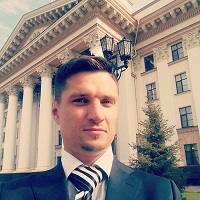

## Personal data
  
Name:   Aleksandr Doronin  
Location: Russian Federation  
## Projects 
Name: [ODMCoin](../projects/odmcoin.md)  
Position: CEO   
## Contacts      
[Facebook](https://www.facebook.com/profile.php?id=100001016342802)  
[Telegram](https://t.me/aleksdor)
## About
Key experience: 7 years of management work, working in international distribution company with a turnover of 5 billion rubles. The management and the opening of three branches. 1.5 years of work in the Government of the Tyumen region. Modernization of industrial enterprises. Foreign investment projects in the oil and gas industry. Localization of production of foreign companies. Education: 2013 Presidential program of management training. Production management 2010 Mini MBA of NP TSPK "Russian school of management", Organization management.
