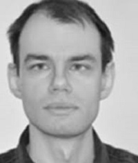

## Personal data
  
Name:   Alex Zhukov  
Location: Russian Federation  
## Projects 
Name: [LiveEdu](../projects/liveedu.md)  
Position: Backend Development   
## Contacts
[LinkedIn](https://www.linkedin.com/in/drdaeman/)  
[GitHub](https://github.com/drdaeman)
## About
Experienced Python/Django developer. Also proficient with JavaScript, React.js, Go, C, and Erlang/OTP. Self-taught programmer. Masters in radiophysics. Worked in software, systems and networking positions at ISPs such as Novgorod Datacom and Alphacom.
