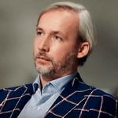

## Personal data
  
Name: Alexander Borodich    
Location: Russian Federation
## Projects 
Name: [GraphGrail AI](../projects/graphgrail.md)  
Position: Venture investor and CMO
## Contacts
[LinkedIn](https://www.linkedin.com/in/borodich/?ppe=1)  
[Facebook](https://www.facebook.com/borodich)  
[Twitter](https://twitter.com/borodich)  
## About
Alex is a futurist, angel investor, and a serial entrepreneur. He is the founder of the elite club VentureClub. Previous projects include MyWishBoard, MyDreamBoard, and SuperFolder. His angel investments include Future Action, where he is the Chief Dreams Officer and controlling partner. Founder of FutureLabs Future Laboratory and the crowd investment platform VentureClub.ru. Alex is an investor in more than 70 projects.
Alex was previously the CMO of the Mail.ru Group and Acronis. He has been an entrepreneur since 2010. He is also Director of the Economics and Mathematics School at Moscow State University, where he has taught a course on the development of creative thinking and entrepreneurial skills since 2003.
