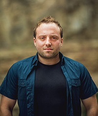

## Personal data
  
Name: Alexander Siria  
Location: Georgia
## Projects 
Name: [EQUI](../projects/equi.md)  
Position: Co-founder & CEO 
## Contacts
[Telegram](https://t.me/equiteam)  
[Twitter](https://twitter.com/alxequi)
## About
More than 10 years in commercial project development. Over 6 years in iOS application development. Designed, created and successfully launched numerous existing commercial platforms including SkyWays airline ticket portal owned by Discovery, Georgia’s largest provider of the ground services in the aviation sector and travel Industry. Consulted and supported more than 100 small businesses on benefits of modern technologies and online marketing. 5 years in high-tech retail market. 2010-2015, co-owner and CEO of Yappe, a web based multifunctional social platform with business features, which later was transformed to EQUI. Owns several concept street food businesses.
