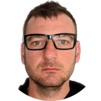

## Personal data
  
Name:   Andrew Rabinovich  
Location: USA  
## Projects 
Name: [Neuromation](../projects/neuromation.md)  
Position: Advisor   
## Contacts
[LinkedIn](https://www.linkedin.com/in/andrew-rabinovich-28556014/)  
[Facebook](https://www.facebook.com/andrew.rabinovich.10)
## About
World leading scientist in Deep Learning and Image Recognizing research. Andrew has been studying machine learning with an emphasis on computer vision for over 15 years. He is the author of numerous patents and peer-reviewed publications. He founded a biotechnology startup, that was acquired. Andrew Received a PhD in Computer Science from the University of California, San Diego in 2008. Worked for years on leading R&D position in Google, Magic Leap where he is currently Director of Deep Learning.
