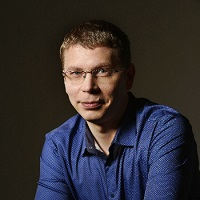

## Personal data
  
Name:   Andrew Zimine  
Location: Estonia  
## Projects 
Name: [Exscudo](../projects/exscudo.md)  
Position: Co-founder & CEO   
## Contacts
[LinkedIn](https://www.linkedin.com/in/andrew-zimine-586300141/)    
[Twitter](https://twitter.com/andrewzimine)  
## About
Andrew is the Owner and CEO of Clarus, a major Russian developer of exchange systems and security and ERP-systems for companies. He is a consulting expert on DAPPS Ethereum and consults major Russian financial market players on cryptocurrencies trading. Andrew is an expert on blockchain technologies and decentralized cryptographic data transfer networks. He has over 8 years of experience in managing of companies and over 18 years of experience in IT technologies and their integration into the real sector of economy.
