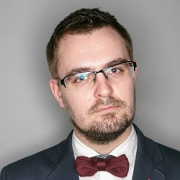

## Personal data
  
Name:   Andrius Milinavicius  
Location: Lithuania  
## Projects 
Name: [IUNGO Network](../projects/iungo_network.md)  
Position: CMO   
## Contacts
[LinkedIn](https://www.linkedin.com/in/andriusmil/)    
## About
Experience-driven freelancer. Working with event organizing, managing conferences, fundraising for various ideas. Past 12 years spent with digital marketing and communication. Lately started speaking in the conferences together as moderating them on stage. Experienced working in multicultural environment, well acquainted with Estonian, Latvian and Lithuanian markets. 
Have a clear understanding of mass media and a strong experience in driving a brand awareness campaigns together with launching new projects.
Specialties: Marketing communication, strategy, brand building, sales. Event production, logistics, artist management. Negotiating, group work, management, marketing plans, public relations.
