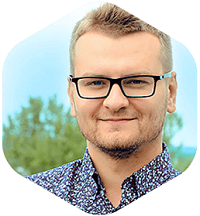

## Personal data
  
Name:   Andrius Putna  
Location: Lithuania  
## Projects 
Name: [BitDegree](../projects/bitdegree.md)  
Position: Co-founder & CEO   
## Contacts
[LinkedIn](https://www.linkedin.com/in/andriusputna/)    
[GitHub](https://github.com/fordnox)  
## About
11 years in software engineering. Blockchain evangelist. Person behind the success of 000webhost - world’ first and biggest free cloud hosting platform designed for learning, testing and experimenting. His way-ahead-of our-time mindset and passion for technologies led him to become the CEO and one of the founding members of BitDegree where, on the long term, he aims to revolutionize education and shape it to today’s businesses needs.
