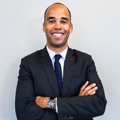

## Personal data
  
Name:   Anil Benard-Dende  
Location: France  
## Projects 
Name: [Fluz Fluz](../projects/fluz_fluz.md)  
Position: Board Advisor   
## Contacts
[LinkedIn](https://www.linkedin.com/in/anil-benard-dende-177602/)    
## About
Anil Benard-Dende is currently the COO of Showroomprive, the second largest flash sales ecommerce company in Europe. his responsability embrases sales and digital factory (all the content production), supply chain and logistics, transportation and delivery, customer care and the transversal project management team (mobile, front office and back office tools). The team is 600+ people and the budget 100+ M€ / year.
He is also sharing his knowledge and expertise as a startup and board advisor.
He was previously VP, International at Cnova, was also in charge of the advertising business for France. Cnova is one of the largest global eCommerce companies, with operations in Europe, Latin America and Asia. Cnova’s current geographies represent over 460 million people with Cdiscount sites in France, Colombia, Thailand, Vietnam, 3 countries in Africa and Nova Pontocom operations in Brazil.
Before this position, Anil had senior executive positions at Casino and Cdiscount / Cnova: he joined the Casino Group in 2007 and was promoted in 2009 to Logistics and Supply Chain VP at Cdiscount.com, the #3 eCommerce player in Europe and #1 in France. In 2012, Anil creates the Development Division and accelerates the growth and profitability of the advertising business (3W Regie). Anil also worked for the Kering Group, where he had several management positions in France and Switzerland as Supply Chain Director. He started his career, from 1998 to 2001, as a consultant for PwC. Anil holds a Master’s Degree in Sciences and Mechanical Engineering from the “Arts et Métiers”.
Strategy, eCommerce, Digital, Supply Chain, General Management, Business Development, Program management, Project management.
