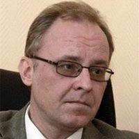

## Personal data
  
Name:   Anton Galenovich  
Location: Russian Federation  
## Projects 
Name: [DAO IPCI](../projects/dao_ipci.md)  
Position: Co-founder & Lead Developer   
## Contacts
[LinkedIn](https://www.linkedin.com/in/anton-galenovich-4115818/)      
[Facebook](https://www.facebook.com/anton.galenovich)
## About
25 years of experience in International Relations and External Liaison including Government and Public Relations. Profound theoretic and practical expertise in the field of international diplomacy, economic, corporate, business intelligence, planning, structuring and implementing of top level negotiation process.
For the last 10 years dealing with integral complex of diplomatic, international, economic, environmental, emissions trading, UNFCCC and Kyoto Protocol issues, sustainable development and business opportunities that derive from these environmental initiatives. 
Dr. Galenovich has worked under contracts with major Russian Corporations and NGOs, and other organizations that are interested in emissions credits and quota trading, energy efficiency, and capacity building in Russia providing for successful contacts, negotiations and cooperation of state authorities, major business companies and NGOs.
Specialties: Primary specialty: external liaison – GR – corporate information – Kyoto Protocol.
