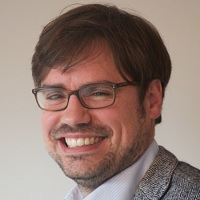

## Personal data
  
Name:   Arnaud Dartois  
Location: France    
## Projects 
Name: [Napoleon X](../projects/napoleon_x.md)  
Position: COO   
## Contacts
[LinkedIn](https://www.linkedin.com/in/arnaud-dartois-036a10/)     
[Facebook](https://www.facebook.com/arnaud1978)
## About
After several years working as a private equity investor, mainly in the health and waste business, Arnaud became independant advisor and entrepreneur. He's got interested in Blockchain since 2015 and met Stephane during the Data Science Program organized by École Polytechnique (French MIT). They formalized the DAF concept in December 2016 and decided to launch NaPoleonX afterwards, to revolutionize the emerging blockchain investment universe. Arnaud holds a MS from École Polytechnique and PhD in Computer Science (Algebraic combinatorics) from École Polytechnique and ENS.
