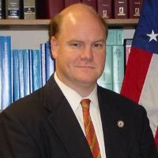

## Personal data
  
Name:   Arnold Spencer  
Location: USA  
## Projects 
Name: [TaaS](../projects/taas.md)  
Position: Advisor   
## Contacts
[LinkedIn](https://www.linkedin.com/in/arnold-spencer-963777/)      
## About
Mr. Spencer serves as General Counsel for Coinsource, the leading operator of Bitcoin ATMs in the United States.  He oversees all legal and compliance matters for Coinsource, and participates in strategic planning and operations. Mr. Spencer speaks and writes about Bitcoin, blockchain, and compliance challenges in the digital currency industry.  He authored the chapter addressing international money laundering for International White Collar Enforcement (Aspatore, 2015). From 2000 to 2010, Mr. Spencer served as an Assistant United States Attorney in the Eastern District of Texas.  He specialized in securities fraud, financial fraud, and money laundering prosecutions, and personally prosecuted more than 100 federal cases.  Mr. Spencer was selected as one of the trial lawyers that prosecuted criminal violations arising from the collapse of Enron.  Among other high profile cases, he prosecuted a South American casa de cambio for violations of the Bank Secrecy Act, and obtained the one of the longest sentences ever imposed by a federal judge against a defendant for money laundering.  At the Justice Department, Mr. Spencer was a national speaker, author and leader of nationwide implementation of SAR Task Forces.  In 2006, the Attorney General for the United States awarded Mr. Spencer the John Marshall Award, the highest award presented to a Justice Department attorney for contributions and excellence in legal performance. Prior to his civil service, Mr. Spencer worked at Haynes & Boone, LLP in Dallas, Texas and Morgan Stanley in New York.  He graduated from Amherst College and the University of Texas Law School.
