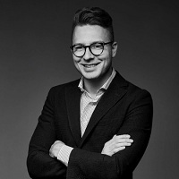

## Personal data
  
Name:   Artūras Asakavičius  
Location: Lithuania  
## Projects 
Name: [WePower Network](../projects/wepower_network.md)  
Position: Co-Founder & Investments   
## Contacts
[LinkedIn](https://www.linkedin.com/in/arturasasakavicius/)      
[Facebook](https://www.facebook.com/arturas.asakavicius)
## About
[Info](http://www.sorainen.com/en/People/31/Art%C5%ABras.Asakavi%C4%8Dius)  
Artūras is practising law at one of the biggest law firms in the Baltics, where he is responsible for all fintech blockchain and crypto currency related businesses and regulations. He is also Lithuanian fintech association chairman and two times recognised as the Lithuanian crowdfunding patron by the EU Commission.
