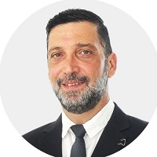

## Personal data
  
Name:   Avi Ben David  
Location: Israel  
## Projects 
Name: [Lendoit](../projects/lendoit.md)  
Position: Co-founder & President   
## Contacts
[LinkedIn](https://www.linkedin.com/in/avi-ben-david-bb3651110/)      
## About
Entrepreneur, founder & CEO of Pareto Mergers & Acquisition, a leading financial advisory for public and private companies. Avi has more than 27 years of professional experience in the financial markets serving among other things as board member for several public companies. Avi got his first Bitcoin in 2013 and since then was always looking for the opportunity to take part in the blockchain eco-system.
