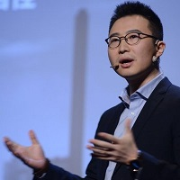

## Personal data
  
Name:   Cao Yin  
Location: China  
## Projects 
Name: [DAO IPCI](../projects/dao_ipci.md)  
Position: Advisor   
## Contacts      
[LinkedIn](https://www.linkedin.com/in/caoyin/)  
## About
Mr. Cao Yin is the Founding Partner and Chief Strategy Officer of the Energy Blockchain Labs, which is the world first company focused on blockchain technology energy and green finance application.
He also is the Principal Expert of Blockchain as well as the Principal Energy Analyst of China Cinda Securities, which is the investment bank of China Cinda Group, the biggest financial asset management company in China. Mr. Cao also performs as stratigics advisor for several famous energy and finance companies. 
Mr. Cao Yin is one of the earliest proponents of the energy Internet concept in China. He participated in the formulation of China‘s national definition of Energy Internet and participated in the formulation and popularization of China’s National Energy Internet Action Plan as one of the leaders of the task force. 
Mr. Cao has written several books, including 《Development of Energy Internet》,《Introduction of Energy Internet》, he also has written a book <Internet+: National Strategic Action Roadmap> with Mr. Ma Huateng, the Chairman of Tencent Group.   
