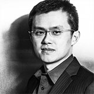

## Personal data
  
Name: Changpeng Zhao     
Location: China
## Projects 
Name: [Binance coin](../projects/binance_coin.md)  
Position: CEO
## Contacts
[LinkedIn](https://www.linkedin.com/in/cpzhao/)  
## About
Changpeng Zhao is the founder and CEO of BijieTech, a company that
provides cloud-based exchange systems to exchange
operators. Since founding in Sept 2015, BijieTech now powers
30+ exchanges in Asia. In the first 12 months since founding,
BijieTech closed 36.1 million RMB ($5.3MM USD) in revenue,
and will double that in its second year. BijieTech has never
accepted any outside investments, being cash flow positive
from day one.    
As soon as the Binance ICO finishes, CZ will remain a shareholder of BijieTech, but
will relinquish all of his management duties to a new CEO. CZ will focus exclusively
on Binance. This applies to all BijieTech members listed in this whitepaper.  
Prior to BijieTech, CZ was the co-founder and CTO of OKCoin. During his stay
there, OKCoin launched their international site, and their futures trading platform.
Co-ordinating with Stefan Thomas, CZ also lead the first proof-of-reserves in any
China crypto exchange. Most other major exchanges in China followed soon after.
In addition to managing the tech team there, he also lead the international marketing
team. He is still mentor to and good friends with Zane Tackett.   
Before OKCoin, CZ was the Head of Technology and the 3rd person to join the
Blockchain.info team. He worked closely with Ben Reeves, Roger Ver, Anthony
Antonopoulos and Nicolas Cary to grow the Blockchain.info service.  
Before Blockchain.info, CZ co-founded Fusion Systems Ltd in 2005, a company that
specializes in ultra-low-latency trading systems for brokers. Fusion Systems was
started in Shanghai, and currently has offices in Tokyo, Hong Kong, and Los
Angeles. Among other tasks, CZ was responsible closing and deploying trading
systems at Credit Suisse, Goldman Sachs, Deutsche Bank, and more. CZ left
Fusion System to work full time in the blockchain industry in 2013.  
Before Fusion Systems, CZ was the Head of Development at Bloomberg Tradebook
Futures for 4 years, in New York. There CZ managed a team that was responsible
for the entire futures trading platform in Bloomberg, with annual revenues exceeding
$300 million USD.  
Prior to Bloomberg, CZ’s college internship and first job out of college was in Tokyo,
working for a tech outsource company that was involved in developing trading
systems for the Tokyo Stock Exchange. This is where his exchange experience
began.  
CZ was born in China and went to high school and college in Canada. CZ is fully
bilingual in English and Chinese, and can speak basic Japanese.  