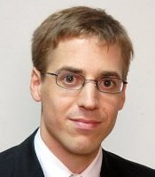

## Personal data
  
Name: Christian Reitwiessner  
Location: Berlin Area, Germany    
## Projects 
Name: [TrueBit](../projects/truebit.md)  
Position: Whitepaper coauthor
## Contacts
[LinkedIn](https://www.linkedin.com/in/dr-christian-reitwiessner-594b0982/)  
## About
 plays an active and pivotal role in the development and maintenance of Ethereum. In addition to researching future directions for the Ethereum community, he led the development of Solidity, the language of Ethereum smart contracts, as well as cpp-ethereum, a client application required to run the network. 