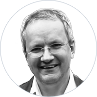

## Personal data
  
Name:  Christoph Mussenbrock  
Location: Germany   
## Projects 
Name: [Etherisc](../projects/etherisc.md)   
Position: Co-founder, Protocol & Architecture  
## Contacts
[LinkedIn](https://www.linkedin.com/in/christoph-mussenbrock/)     
[Twitter](https://twitter.com/liesdorn)  
## About  
Christoph has a long record of accomplishment in the cooperative banking sector in Germany.   

After several years on the board of a cooperative bank, he switched to the IT segment and became Chief Program Manager Credit Solutions and Chief of Strategy Development at Fiducia & GAD IT AG – one of Germany’s biggest IT Service Providers. Since 2015, he has been CEO of parcIT GmbH, one of Germany’s best-known companies specialized in risk management solutions.  

Due to his many years of working in the field of banking and insurance, Christoph is highly experienced in all matters concerning regulatory frameworks. He also co-founded Progeno Wohnungsgenossenschaft eG, a housing cooperative in Munich, which has successfully crowdfunded a large residential project in Munich.  

Christoph has a master’s degree in mathematics and wrote his thesis on formal soft- and hardware verification.