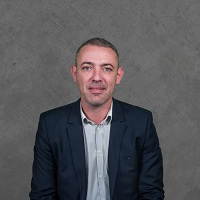

## Personal data
  
Name:    Christophe David  
Location: France  
## Projects 
Name: [DomRaider](../projects/domraider.md)  
Position: CFO     
## Contacts
[LinkedIn](https://www.linkedin.com/in/christophe-david-cfo/)    
## About
Christophe not only graduated from a business school with a degree in international management but he also has a degree in accounting. During his career he has worked in innovation and consultancy as well as setting up of companies. Thus, in 1998, he set up Zencod, a company developing hardware crypto accelerators, which he sold to Thalès in 2004. Always motivated by highly ambitious entrepreneurial challenges, his encounter with DomRaider was a natural fit. The enthusiasm was shared and immediate. Always a leader, he is now the guarantor of investments and fundraising.
