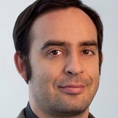

## Personal data
  
Name:   Constantin Goltsev  
Location: USA  
## Projects 
Name: [Neuromation](../projects/neuromation.md)  
Position: Chariman & Investor   
## Contacts
[LinkedIn](https://www.linkedin.com/in/constantinegoltsev/)      
[Facebook](https://www.facebook.com/constantine.goltsev)
## About
Serial entrepreneur and online advertising industry veteran, Constantine has more than 20 years of experience in software and product development. He is the former CEO and founder of the pioneering video advertising network AdoTube, which grew from humble beginnings to 200 employees selling in 23 markets with 13 offices worldwide. AdoTube subsequently was sold to Exponential Interactive. He is a Founder and President of SolidOpinion — a company that has revolutionized engagement in online communities around content.
