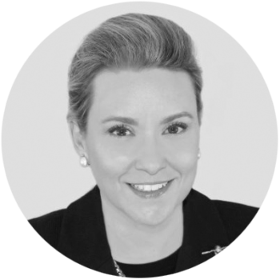

## Personal data
  
Name: Cristina Dolan   
Location: USA  
## Projects 
Name: [InsureX](../projects/insurex.md)  
Position: Co-Founder & COO   
## Contacts
[LinkedIn](https://www.linkedin.com/in/cdolan/)  
[Twitter](https://twitter.com/CrisDolan)  
## About
Cristina is an MIT Media Lab alumna and Internet pioneer with over two decades of experience building software, content, and Internet based businesses. She was a co-founder of OneMain.com, which grew to be the 10th largest ISP after a successful IPO (Acquired by Earthlink). She is a member of Forbes Technology Council and is Chair of the MIT Enterprise Forum in New York where several events have been hosted with industry leaders covering blockchain technology.
