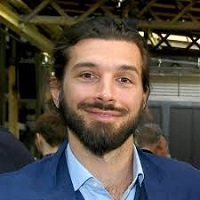

## Personal data
  
Name:   Cyrus Fazel  
Location: Switzerland  
## Projects 
Name: [SwissBorg](../projects/swissborg.md)  
Position: Co-founder & CEO   
## Contacts
[LinkedIn](https://www.linkedin.com/in/cyrusfazelmrfintech/)    
[Twitter](https://twitter.com/Cyrus_Fazel)  
## About
Cyrus is a multicultural fintech professional with more than a decade of experience in Asset Management and Algo Trading. Throughout his experiences, he has grown as a person and professionally gaining skills such as multitasking, team building, and effectively working under pressure. 
He developed his analytical skills by managing and advising UHNWI on all asset classes as a Portfolio Advisor. Shortly after, he became a Hedge Fund Advisor and Senior Business Developer for Top Hedge Funds. There, his tasks included performing highly detailed qualitative and quantitative analysis, performing due diligence, advising institutional clients, and creating all kinds of marketing materials. 
