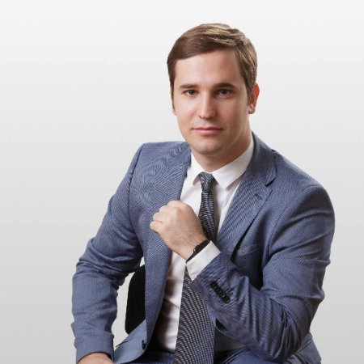

## Personal data
  
Name: Dan Cearnau   
Location: Romania  
## Projects 
Name: [COSS](../projects/coss.md)  
Position: Co-Founder, Team Leader 
## Contacts
[LinkedIn](https://www.linkedin.com/in/dancearnau/)  
[Twitter](https://twitter.com/DanCearnau)  
## About
Dan manages the technical aspects of the COSS system including the intricacies of
the development and the security of the project’s information. He is
cryptocurrency enthusiast, blockchain developer and experienced entrepreneur
with background in advising, consulting and IT development of diverse products
enhancing the efficiency of startups, companies and organizations. Dan owns a
full-stack development company that has worked with Fintech startups, and
successfully implemented smart-contract applications on Ethereum as well as
within the other frameworks
