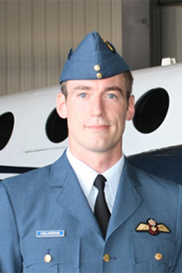

## Personal data
  
Name:   Daniel Desjardins   
Location: Canada  
## Projects 
Name: [Kings Distributed Systems](../projects/kings_distributed_systems.md)  
Position: VP of business development       
## Contacts
[LinkedIn](https://www.linkedin.com/in/daniel-desjardins-phd-5a0265140/)  
## About
After completing a PhD in Physics at Queen's University, Dan became a professor for the Department of Physics and Space Science at the Royal Military College of Canada. In addition to being a pilot for the Royal Canadian Air Force he was the Public Affairs Officer for unit 424 Search and Rescue Squadron administering media outreach and inquiries. He has been personally entrenched in advanced physics modelling and brings valuable experience to all sides of our business.
