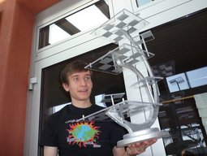

## Personal data
  
Name:  Daniel Kraft (domob)
Location:
## Projects 
Name: [Namecoin](../projects/namecoin.md)  
Position: Chief Namecoin Scientist
## Contacts
[Github](https://github.com/domob1812)  
[Website](https://www.domob.eu/)  
## About
Daniel is lead C++ developer, currently working on Namecoin Core. Daniel is also our specialist for identity applications, being the author of NameID, the Bitmessage Namecoin integration, and the OTR Namecoin integration. Daniel has a PhD in Mathematics from the University of Graz in Austria.

