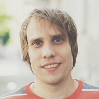

## Personal data
  
Name:   Daniel Rudolph  
Location: Germany  
## Projects 
Name: [Unikrn](../projects/unikrn.md)  
Position: CTO   
## Contacts
[LinkedIn](https://www.linkedin.com/in/decrypted/)      
## About
Daniel, located in Berlin, has been working with Rahul since 2008, creating the first-ever skill betting platform for video games, PlayAll. Daniel is pinned down to computers for over 25 years, with his first job landed at 16 to design and develop backend systems for banks and insurance companies. After a brief excursion at PlayAll, he started back into esports. Daniel also helped a Fintech company to build a Bitcoin Exchange together with a small German bank. Daniel is always focused on enabling products and ideas, but is also the last line of defence to make stuff just ultimately work in a reliable and scalable way connecting a distributed team.
