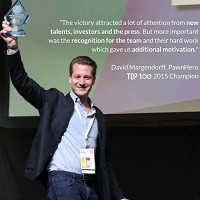

## Personal data
  
Name:   David Margendorff  
Location: Philippines  
## Projects 
Name: [Hero](../projects/hero.md)  
Position: Founder & Chairman   
## Contacts
[LinkedIn](https://www.linkedin.com/in/davidmargendorff/?lipi=urn%3Ali%3Apage%3Ad_flagship3_search_srp_people%3Ba4W9Gu67TR2QAwv%2FsCsSHg%3D%3D&licu=urn%3Ali%3Acontrol%3Ad_flagship3_search_srp_people-search_srp_result&lici=7a8NySy2RyaDwQfH69gfnA%3D%3D)    
## About
At the age of 16, he started his first e-commerce business, a field he is very passionate about. Today, he is part of a very exciting Fintech startup, PawnHero – the 1st Online Pawnshop in Southeast Asia. PawnHero won multiple awards including the "Most Innovative Company" at the Asia CEO Awards, the"Most Promising Startup in Asia"​ at Echelon Asia Summit and was covered by Forbes, Wall Street Journal, Bloomberg, TechCrunch among others. 
He lived in 7 countries across 3 continents, where he has earned international academic experience from universities in London, Buenos Aires, Barcelona and the US. Previously, he launched Malaysia's leading financial comparison website and led the expansion in the Philippines. CompareAsiaGroup is now the largest financial comparison website in Asia and the most valued Fintech startup in SE Asia.
He has worked for a private equity firm in Switzerland, where he was directly engaged in fund raising as well as in reviewing, evaluating and structuring of potential investment opportunities.
He also worked for Ernst & Young, one of the world’s leading professional services organization. Moreover, he gained an insight into Corporate Finance while working in the City of London. He was also a finalist in the 2011 Deloitte Top Technology Competition and received an award for innovation in the German e-commerce space.
