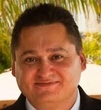

## Personal data
  
Name:   David Mondrus  
Location: USA  
## Projects 
Name: [Trive](../projects/trive.md)  
Position: CEO   
## Contacts
[LinkedIn](https://www.linkedin.com/in/mongoosenewyork/)    
[Twitter](https://twitter.com/mongoosenewyork)  
[Facebook](https://www.facebook.com/mongoosenewyork)
## About
Past: Employee #5 at Bigfoot.com, CTO at Bigstar.com and CEO of OneModelPlace.com. David is an avid Bitcoin and CryptoCurrency Enthusiast. He has founded and participated in a number of Bitcoin projects including Bitnation, iNation, ND Coin, BTC2MYSQL and MiningSlicer. David and his wife Joyce, were the first couple to get married on the blockchain. David holds an MBA from Columbia University and has written for Bitcoin Magazine.
