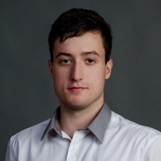

## Personal data
  
Name:   Denis Donin  
Location: Russian Federation  
## Projects 
Name: [ATLANT](../projects/atlant.md)  
Position: Co-founder & CTO
## Contacts
[LinkedIn](https://www.linkedin.com/in/denis-donin-968a4a102/)    
[Facebook](https://www.facebook.com/varsize)  
[Crunchbase](https://www.crunchbase.com/person/denis-donin#/entity)  
## About
Over 5 years of blockchain & cryptocurrency development experience, consulting clients on blockchain technology, smart contract systems, and distributed application stacks. Former CTO of SpaceBTC.com, technical advisor of BTC-UP.com project and MarginCall software tech leader. Proficient in C++, C#, Python, Javascript and Solidity.
