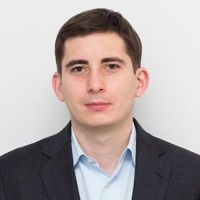

## Personal data
  
Name:   Denis Simagin   
Location: Russian Federation  
## Projects 
Name: [LAToken](../projects/latoken.md)  
Position: Managin Director  
## Contacts
[LinkedIn](https://www.linkedin.com/in/dsimagin/)    
[Facebook](https://www.facebook.com/denis.simagin?sw_fnr_id=2457334272&fnr_t=0)    
## About
Former Engagement Manager at McKinsey&Company (5 year tenure). Co-founder of Compensair Ltd. Held various investment roles in leading Russian private equity funds where he managed portfolio investments of $400 mln. MSc in Finance from The London School of Economics (LSE).
