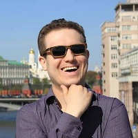

## Personal data
  
Name:   Dmitriy Solodukha  
Location: Israel  
## Projects 
Name: [Solar DAO](../projects/solar_dao.md)  
Position: Co-founder & CEO
## Contacts
[LinkedIn](https://www.linkedin.com/in/solodukha/)    
[Facebook](https://www.facebook.com/dmitriy.solodukha)  
[Twitter](https://twitter.com/dmitrysolodukha)  
[Blog](https://medium.com/@NeiTrinO)  
## About
PV Expert  
Specialties: 
- Bilingual (English and Russian) expert with nearly 9 years of experience
- Experienced with BiFacial technology (cells and modules)
- Familiar with long-life solar modules technology 
- Glass-glass solutions for solar modules production
- Design and project off-grid, on-grid, stand alone and hybrid solar systems
- Engineering fast payback PV Plants
- Marketing and promoting experience of PV products
- Presentation skills
- Strong network of contacts
- PV PLANT TURNKEY PROJECTS
