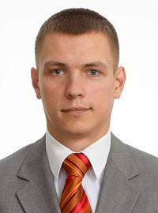

## Personal data
  
Name:    Dmitry Nagornykh  
Location: Russian Federation     
## Projects 
Name: [Sosnovkino](../projects/sosnovkino.md)  
Position: CIO   
## Contacts    
[Facebook](https://www.facebook.com/d.nagornyh)
## About
IT specialist. Master's degree in Information Technologies and Computational Systems in Novosibirsk State University. Now he works on PhD in Informatics Systems and as Senior Teacher in Novosibirsk State University, General Informatics Department. He is a professional in artificial intelligence, neural nets, computational systems and blockchain technologies. He participated in several successful projects connected with distributed computational systems for SEO and hybrid neural nets.
