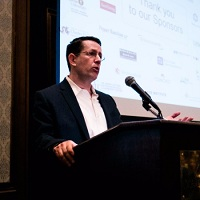

## Personal data
  
Name:   Ed Zabar  
Location: USA  
## Projects 
Name: [Verif-y](../projects/verif-y.md)  
Position: Founder & CEO   
## Contacts
[LinkedIn](https://www.linkedin.com/in/edzabar/)    
[Twitter](https://twitter.com/ezabarv)  
[Facebook](https://www.facebook.com/ezabar?ref=br_rs)
## About
Ed Zabar has over 25 years of professional experience, most recently founding and managing Verif-y. Prior to founding Verif-y, Ed served as a turnaround CEO of a UK technology company with $40M in revenues, where he returned the company to profitability and prepared it for a sale.
Prior to this role Ed was a senior investment banker with several leading boutique firms in New York and Philadelphia. In these roles, he focused mainly on mergers and acquisitions and funding of early and expansion stage Technology, Media and Telecom companies. In addition to his role as managing director at Oberon Securities in New York, Ed also fulfilled the roles of COO and CTO and was a big part of the management team’s success in propelling the investment bank to a strong market position. Prior to his work as an investment banker, Ed was: Vice President at a New York based venture capital firm as well as a US/Hong Kong family office where he executed multiple transactions with technology companies in various stages of development.
Prior to these roles, Ed served as an Executive Vice President of sales and marketing at ViewTrade Securities where he was instrumental in increasing the company's global client base and its revenues from $500,000 to over $15M a year; and a financial and technology consultant at Goldman Sachs and PwC where he advised many fortune 500 financial services and manufacturing firms. Ed also co-founded and exited two technology startups in the late 90’s early 2000’s. Ed served in the military as a lieutenant in various roles including, Intelligence and at the core of engineers.
Ed holds an MBA from Columbia University and a BS in Finance and Information Technology from New York University.
