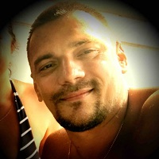

## Personal data
  
Name:   Fedor Savchenko  
Location: Russian Federation  
## Projects 
Name: [Neuromation](../projects/neuromation.md)  
Position: CTO   
## Contacts
[LinkedIn](https://www.linkedin.com/in/fedor-savchenko-6687772/)      
## About
Fedor has more than 20 years of experience leading complex software development projects with emphasis on computer graphics, 3D engines, CGI production and VR environments. He holds degrees in both mathematics and graphic design. This unique perspective allows him to build software that manages to be functional and beautiful at the same time. He is an innovator who is always on the cutting edge of the latest trends.
