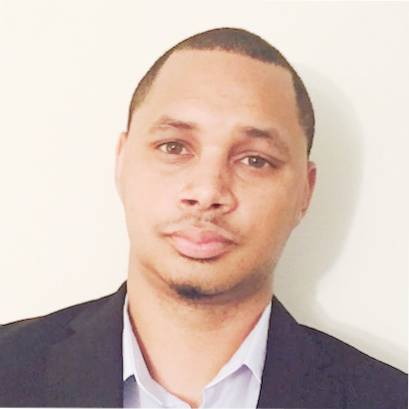

## Personal data
  
Name:  Garnie Morgan   
Location: Greater Atlanta Area, USA
## Projects 
Name: [Patientory](../projects/patientory.md)
Position: COO  
## Contacts
[LinkedIn](https://www.linkedin.com/in/garnie-morgan-7a0b4a76/)  

## About
Garnie Morgan has 15 years of industry experience in merchant acquiring. Most recently, he served as Director of Operations at I3Verticals, Inc., where he focused primarily on executed the integration and operations of 5 companies and merged them into the main operations center in Georgia. Before joining I3Verticals, Garnie was the Operation Manager for US Data Capture, dealing in over 3 billion dollars of processing volume primarily working in Health and Education. He is excited to assist in transforming the healthcare industry and being at the forefront of a new healthcare era with the Patientory team. 
Experienced Operations professional with proven success managing company wide initiatives and leading large
scale projects from inception to successful completion, while executing sound strategic decisions.