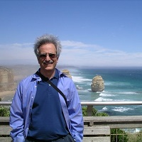

## Personal data
  
Name:   Gary Marchionini  
Location: USA  
## Projects 
Name: [Peerity](../projects/peerity.md)  
Position: Advisor   
## Contacts
[LinkedIn](https://www.linkedin.com/in/gary-marchionini-11135618/)  
[Twitter](https://twitter.com/marchionini)
## About
[Wikipedia](https://en.wikipedia.org/wiki/Gary_Marchionini)  
Information & Technology Scientist, Published Author and Professor at University of North Carolina Chapel Hill.
Gary is a renowned information technology researcher. He led the 'Open Video Project' sponsored by Google, where he worked with Brenn Hill on the groundbreaking video solutions. He developed Agile View for dynamic video browsing, sponsored by NSF. He also received multiple prestigious industry grants and awards from Google (2007,-08 and 2010), IBM (2006,-07), Microsoft and the American Society for Information Science and Technology.
