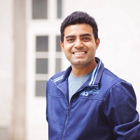

## Personal data
  
Name:   Gaurang Torvekar  
Location: Singapore
## Projects 
Name: [Indorse](../projects/indorse.md)  
Position: Co-founder & CTO
## Contacts
[LinkedIn](https://www.linkedin.com/in/gaurangtorvekar/)    
[Twitter](https://twitter.com/gaurangtorvekar)
## About
Co-founder and CTO at Attores, a blockchain company. Guarang is responsible for the development of smart contract templates in Solidity and he have been writing them on a daily basis. He is passionate entrepreneur and a techie with almost 4 years of experience in Software Development in a range of startups across India and Singapore. He have also been a Blockchain mentor at some hackathons; involved in arranging Ethereum Meetups and also conduct regular workshops on hands-on Blockchain coding.
