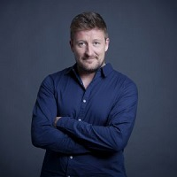

## Personal data
  
Name:   Gerard Bel  
Location: Spain  
## Projects 
Name: [Pylon Network](../projects/pylon_network.md)  
Position: CEO   
## Contacts
[LinkedIn](https://www.linkedin.com/in/gerard-bel-803937b1/)    
## About
Background:  
• Electrical Engineering at University of Zaragoza  
• Electrical Engineering Studies focus in Hydrogen Tech at Technical University of Denmark  
• Technical and electromechanical maintenance at Facsa (3 years)  
• Technical Assistant at Dynma (2 years)  
• Programmer in Security Systems at Pymexa (1 year)  
• Electric installation for households and industries at Blasco (2 years)  
• Control Software tools ( matlab, microcontroller, others, ...)  
• 500 hours in Siemens and Omron - PLC programming  
