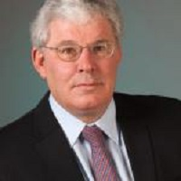

## Personal data
  
Name:   Gerhard Plasonig  
Location: Germany  
## Projects 
Name: [Crowdstart Capital](../projects/crowdstart_capital.md)  
Position: Advisor   
## Contacts
-//-    
## About
Gerhard is founder and Managing Director of GP International SA, Risch, Switzerland, an IPR, technology investment and exploitation company. Before starting GPI, he worked for seven years with The Generics Group, Cambridge, UK, as well as two years for Pugh Roberts Associates in Boston, USA. He has a degree in automotive engineering, a doctorate in strategic technology management from the Vienna University of Economics and Business Administration and was a Fulbright Doctoral Fellow at the Massachusetts Institute of Technology in Cambridge, MA. He holds an Honorary Professorship from the Technical University of Munich, Germany.
