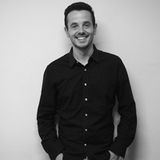

## Personal data
  
Name:   Guillaume Derivery  
Location: France  
## Projects 
Name: [Monaize](../projects/monaize.md)  
Position: Co-Founder & CTO   
## Contacts
[LinkedIn](https://www.linkedin.com/in/guillaume-derivery-07794154/)  
[Facebook](https://www.facebook.com/profile.php?id=100013928466822)
## About
Software expert graduated from EPITECH (2014)
Over the years, he specialised himself in the mobile environment working as a solution architect on different platforms (UI/UX & technical conception) and mastering the mobile innovation world at Netco Sports.
He was then a freelancer working on different end to end innovative solutions.
Now Co-founder, General Director & CTO at Monaize.
