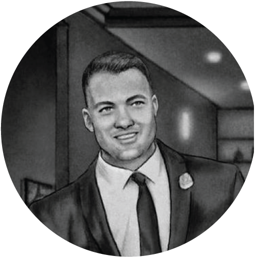

## Personal data
   
Name: Henry Minden  
Location: San Francisco Bay Area   
## Projects 
Name: [Rakugo](../projects/rakugo.md)  
Position: Product
## Contacts
[LinkedIn](https://www.linkedin.com/in/henry-minden-9582825/)   
[Twitter](https://twitter.com/henryminden)   
## About
Henry is passionate about shipping great products. Having delivered to clients ranging from NASA to Disney his understanding of user-driven development makes him a key asset on the SF Rakugo team. He is interested in how blockchain, machine learning, and drone technology can extend human potential. He received his BSME from UCSB and sits on the board of AUVSI-SVC.
