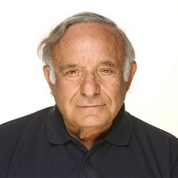

## Personal data
  
Name:   Ichak Kalderon Adizes  
Location: USA  
## Projects 
Name: [CopPay](../projects/coppay.md)  
Position: Co-founder & Member of the board of directors   
## Contacts
[LinkedIn](https://www.linkedin.com/in/ichakadizes/)      
[Facebook](https://www.facebook.com/ichak.adizes)  
[Twitter](https://twitter.com/adizes)  
[Blog](https://medium.com/@louis.torres)  
[Website](http://www.ichakadizes.com/)
## About
Has developed a proprietary methodology of management. Has received 20 honorary doctorates from Universities in ten countries. Dr. Adizes is founder and president of the Adizes Institute, based in Santa Barbara, California, an international consulting company that applies the Adizes Methodology for clients in the public and private sectors.
