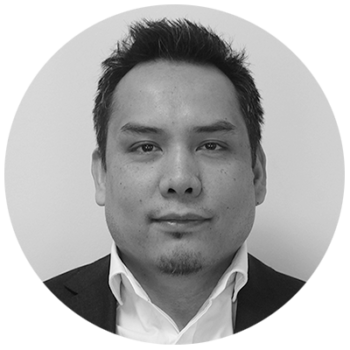

## Personal data
  
Name: Ingemar Svensson  
Location: United Kingdom  
## Projects 
Name: [InsureX](../projects/insurex.md)  
Position: Founder & CEO/CTO   
## Contacts
[LinkedIn](https://www.linkedin.com/in/ingemarsvensson2/)  
## About
Before founding InsureX, Ingemar was the CTO of Risk and Valuation at SunGard Asset Management. His experience ranges from managing large organisations to hands-on software development. Ingemar has spent 20 years building mission critical systems in various roles at Bank of America Merrill Lynch, Barclays Capital, Lehman Brothers and Mitsui Sumitomo Insurance.
