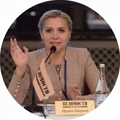

## Personal data
  
Name:   Irina Barzhak  
Location: Russian Federation  
## Projects 
Name: [ODMCoin](../projects/odmcoin.md)  
Position: Press Center Director   
## Contacts      
[Facebook](https://www.facebook.com/profile.php?id=100000607108358)  
[Telegram](https://t.me/iabarzhak)
## About
Key experience:Executive Director of the Eurasian Union of experts on subsoil use.Since 2003 - member of the Union of journalists of Russia. Author of articles in national publications "CEO", "Boss", "Business Russia", "Business magazine", "Drilling and oil". The Author of a unique method of quick preparation of the Quick Step presentation. The author of the book "Magic button against anxiety and other principles of a successful speech", translated into English, published in Canada. Conducting of training of oratory, having first degree in "Directing and acting", as well as experience television for more than 5 years as a reporter, presenter and editor of programs and rubrics. Experience of work as a marketing Director of a major Tyumen companies "Avtograd", "Tyumbit", etc.
