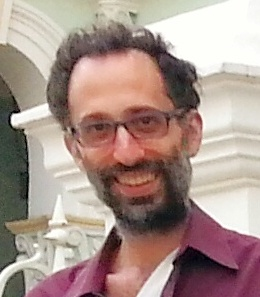

## Personal data
  
Name: Jason Teutsch 
Location: Singapore 
## Projects 
Name: [TrueBit](../projects/truebit.md)  
Position: Founder
## Contacts
[Profile](https://people.cs.uchicago.edu/~teutsch/)  
[Facebook](https://www.facebook.com/jteutsch)  
## About
 is a mathematician and computer scientist whose research focuses on distributed systems security, game theory, and algorithmic randomness. He has held postdoctoral positions at National University of Singapore, Penn State, and Universität Heidelberg, research positions at think tanks RAND and IDA, and multiple Fulbright fellowships.