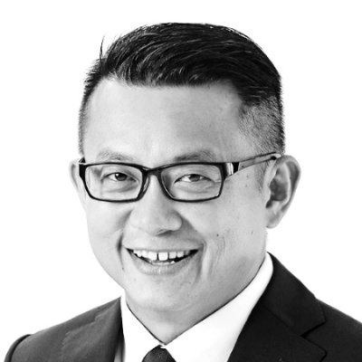

## Personal data
  
Name: Jeff Seah  
Location: Singapore  
## Projects 
Name: [Lydian](../projects/lydian.md)  
Position: Advisor
## Contacts
[LinkedIn](https://www.linkedin.com/in/jeffrey-seah-38413a/)  

## About
Former Southeast Asia CEO of Starcom, he has had 15 years of association in two stints, being part of the management team that launched Starcom and Starcom IP Digital Services in Asia Pacific. He set up the company’s inaugural Singapore operation, and returned to helm the Southeast Asia operations and the VivaKi chair. Before Starcom, Seah was with Mindshare as regional lead for Malaysia, Indonesia and Singapore. He was also CEO of Mindshare Singapore. His current focus includes developing blockchain technologies to eliminate ad fraud.  