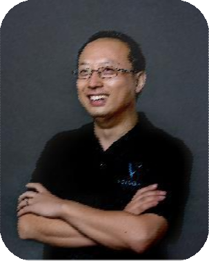

## Personal data
  
Name:  Jianliang Gu
Location: China
## Projects 
Name: [Vechain](../projects/vechain.md)  
Position: Technical Director
## Contacts
-//-
## About
Jianliang was graduated from Shanghai University with
master degree majored in Cybernetics. He was working
in TCL communication technology as Technical Director.
He has more than 16 years' experience in both hardware
and software of embedded system development and
management.
He joined VeChain in 2017 and commit to marry IoT and
Blockchain