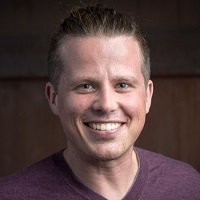

## Personal data
  
Name:   Joel Dietz  
Location: USA  
## Projects 
Name: [Swarm Fund](../projects/swarm_fund.md)  
Position: Co-founder & Partner   
## Contacts
[LinkedIn](https://www.linkedin.com/in/joeldietz/)    
[Twitter](https://twitter.com/fractastical)  
[Facebook](https://www.facebook.com/joel.a.dietz)
## About
Joel co-founded the first smart contract educational channel (EtherCasts), the Ethereum Silicon Valley meetup, wrote the original “AppCoin Manifesto,” and built the first decentralized asset and governance platforms on the Bitcoin blockchain. Joel facilitated the “LoveNest” blockchain-community living space in Palo Alto, holds awards from Google and Salesforce.com, and has presented on topics including Decentralized Autonomous Society, DAO Democracy, Futarchy, and Liquid Democracy. He holds degrees from Brown University and the University of Pennsylvania.
