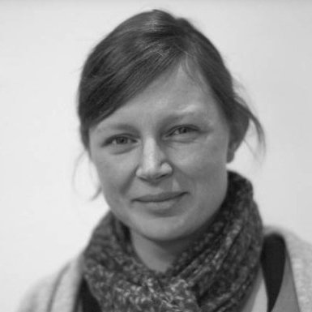

## Personal data
  
Name: Jutta Steiner    
Location: Germany  
## Projects 
Name: [Ambrosus](../projects/ambrosus.md)  
Position: Head of Science  
## Contacts
[LinkedIn](https://www.linkedin.com/in/jutta-steiner-07bb0695/)  
[Twitter](https://twitter.com/jutta_steiner?lang=en)  
## About
Jutta is the co-founder of Parity and Grid Singularity. She previously served as Manager for Security Audit at Ethereum, overseeing security audit and integration for the Ethereum Foundation prior to the launch of the public blockchain in 2015. 
