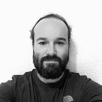

## Personal data
  
Name:   Jérôme Renard  
Location: France  
## Projects 
Name: [Tokenza](../projects/tokenza.md)  
Position: Co-founder & CTO   
## Contacts
[LinkedIn](https://www.linkedin.com/in/jrenard/)      
## About
Jérôme Renard began his career as a technical consultant. He worked for several large institutions such as BPCE Group, the French Ministry of Defense, and companies like Cartier and Lagardère.
In 2012, he co-founded Belogik, a startup specialized in Log Management and Information Retrieval in Big Data. Prior to that, he co-authored the first version of the Varnish book for Varnish Software.
Jérôme is also the CTO of Kasomi Media, Inc., a San Francisco based company he is running with Vincent Fontaine.
